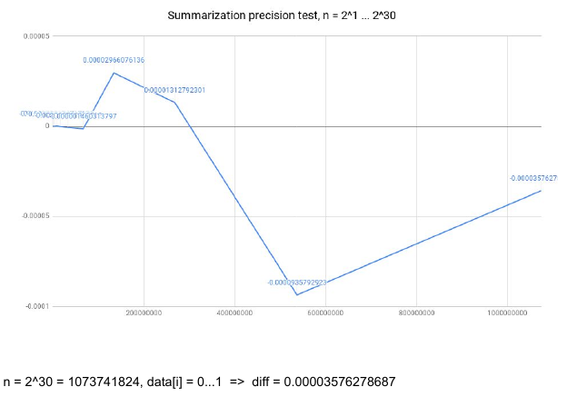
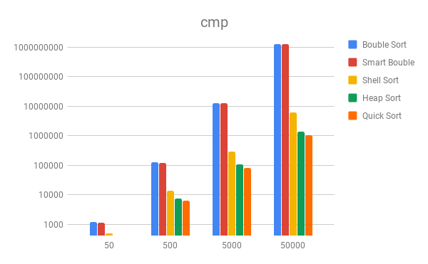
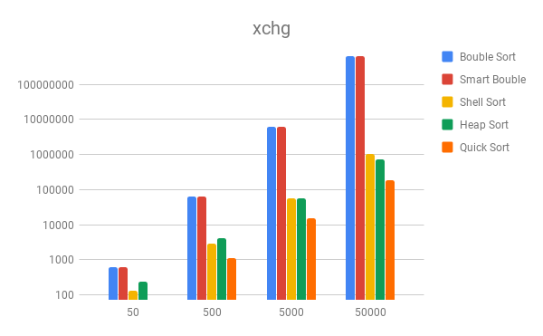
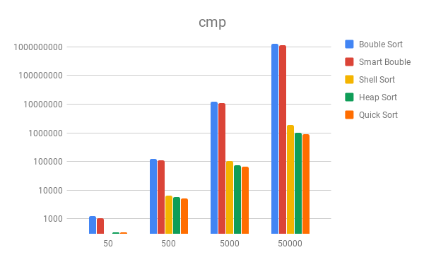
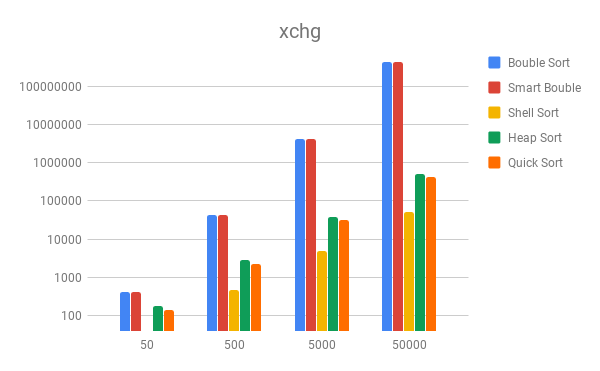
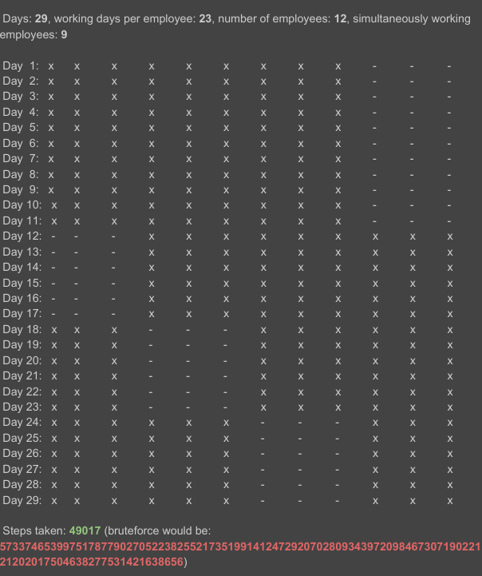

# Effective implementation of algorithms and data structures
_Homework_

3 parts:

## **frog jumps**  
Adding small numbers together. A lot of them.  
How accurate will it be? Is the precision depend on the order of the summarization?
```
gcc frog_jumps.c -o frog_jumps.elf -Wall
./frog_jumps.elf > frog_jumps.out.csv
```


## **sorting test on a dataset with repeated elements**
How repeated values affect sorting algorithms?  
Random values:  

  
Repeated values:  



## **working time schedule builder**
Story: There are not as many tables in the office as employees working there because there is always someone on vacation. There is a specified number of employees at a time. Each employee works a max number of days in a month.  
Applied **backtrack algorithm**.  

